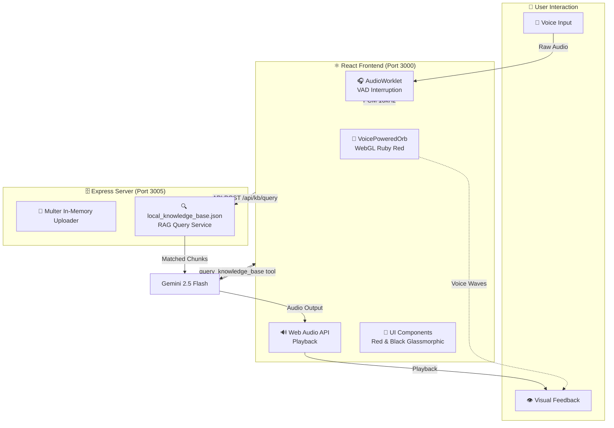

# 🌟 KaaliganAI
### Next-Generation RAG-Powered AI Voice Support Agent

    

A revolutionary **voice-first** customer support AI agent featuring **Gemini 2.5 Flash Native Audio** for bidirectional voice streaming, real-time voice interruption (barge-in), and an in-memory RAG pipeline to immediately ingest, index, and query support documents.

The application has been rebranded to **KaaliganAI**, stylized in a premium **Red & Black** dark mode visual theme with interactive WebGL effects.

---

## 🎯 Key Features

### 🗣️ **Gemini 2.5 Flash Native Audio**
- **Direct Audio-to-Audio**: User's voice → Gemini (native audio understanding) → Tool calls.
- **Bidirectional Streaming**: Low-latency WebSockets for real-time natural voice conversations.
- **Context-Aware RAG**: Maintains continuous context across turns, retrieving facts directly from uploaded documents.

### 📂 **In-Memory RAG & Document Ingestion**
- **Direct PDF/TXT Upload**: Upload support handbooks, product specs, or FAQs directly from the frontend.
- **Dynamic In-Memory Chunking**: The Express backend parses uploaded documents on-the-fly (using `pdf-parse` for PDFs) and splits them into semantic chunks.
- **Zero-Storage Footprint**: Embeddings are generated and indexed directly in-memory, immediately updating the local knowledge base without bloating disk storage.

### 🎨 **Stunning Red & Black Visual Theme**
- **WebGL Interactive Voice Orb**: OGL-powered WebGL orb pulsing with solar flares and dynamic audio feedback in rich ruby red/black.
- **Dynamic Light Rays**: GLSL-shaded animated background rays projecting responsive red lighting.
- **Simplified Single-Page UX**: All legacy pages and complicated routing have been removed. The application loads the voice interface instantly on `/`.

### ⚡ **Immediate Barge-In (Interruption)**
- **AudioWorklet-based RMS**: Local Voice Activity Detection (VAD) stops bot playback immediately (<50ms response) when the user speaks.

---

## 🏗️ System Architecture



---

## 📂 Project Structure

```
KaaliganAI/
│
├── 📁 Lumina Support/              # Frontend Application (React 19 + Vite)
│   ├── 📁 src/
│   │   ├── 📁 components/          # Core UI & WebGL Components
│   │   │   ├── ui/
│   │   │   │   ├── LightRays.tsx          # OGL Light Rays background
│   │   │   │   └── VoicePoweredOrb.tsx    # GLSL interactive Red Voice Orb
│   │   │   └── ...
│   │   ├── 📁 pages/
│   │   │   └── AgentInterface.tsx     # Rebranded main single-page interface
│   │   │
│   │   ├── index.css               # Global styles & Red/Black Tailwind 4 variables
│   │   └── App.tsx                 # Clean root routing
│   │
│   ├── index.html                  # Browser page configuration
│   ├── vite.config.ts
│   └── package.json
│
└── 📁 server/                      # Backend API Server (Node.js + Express)
    ├── databaseServer.js           # Express API endpoints & file ingestion
    ├── local_knowledge_base.json   # Local vector cache fallback
    ├── 📁 services/
    │   ├── geminiService.js        # Gemini embeddings integration
    │   └── ragService.js           # RAG retrieval and storage service
    ├── 📁 documents/               # Optional directory for preload documents
    └── package.json
```

---

## 🚀 Quick Start Guide

### **Prerequisites**
- **Node.js** 18+ and `npm`
- **Google Gemini API Key** ([Get here](https://aistudio.google.com/app/apikey))

---

### **Step 1: Backend Setup**

1. Navigate to the `server` directory:
   ```bash
   cd server
   ```
2. Install dependencies:
   ```bash
   npm install
   ```
3. Create a `.env` file containing your Gemini API key:
   ```env
   VITE_GEMINI_API_KEY=your_gemini_api_key
   ```
4. Start the server:
   ```bash
   npm run dev
   ```
   *The server runs locally at `http://localhost:3005`.*

---

### **Step 2: Frontend Setup**

1. Open a new terminal and navigate to `Lumina Support` directory:
   ```bash
   cd "Lumina Support"
   ```
2. Install dependencies:
   ```bash
   npm install
   ```
3. Create a `.env` file containing your Gemini API key:
   ```env
   VITE_GEMINI_API_KEY=your_gemini_api_key
   ```
4. Start the React development server:
   ```bash
   npm run dev
   ```
   *The frontend runs locally at `http://localhost:3000`.*

---

### **Step 3: Access & Run RAG**

1. Open browser to `http://localhost:3000`.
2. Click the **"Upload PDF/TXT"** button in the header bar and choose a document (e.g. `Customer-Service-Handbook.pdf`).
3. Click the interactive central **Voice Orb** to start the call.
4. Speak naturally and query details from the uploaded document!

---

## 📞 Support & License

This project is licensed under the MIT License. Developed for low-latency native audio voice agents leveraging the Google Gemini API.
